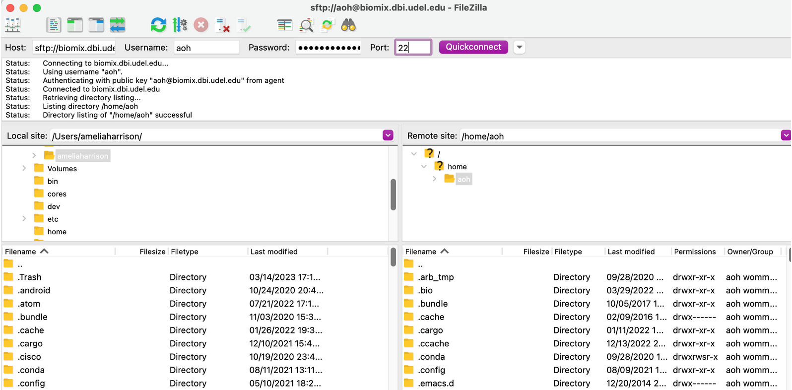

# Transfer a file to Biomix

Next, you are going to transfer a file to your home directory (`/home/your_username`) on Biomix.  You can do this using either the command line or a GUI (graphical user interface, pronounced like gooey).  The GUI is generally the easier option, especially for beginners to the command line.

Before we do the transfer, you'll need a test file.  A plain-text file is best because the contents will be easy to view and we recommend placing the file on your Desktop so that it's easy to find..  My test transfer file just says `Hello, Biomix!` and is named `biomix_transfer_test.txt`.  If you're not sure how to create a plain-text document, check out [this article](https://telsupport.brookes.ac.uk/articles/how-can-i-create-a-plain-text-document/).

## Option 1: FileZilla

There are a few different GUIs for transferring files to and from a remote server.  The one that we recommend is FileZilla.  Visit [this link](https://filezilla-project.org/) to download FileZilla (note that you want the FileZilla client, NOT the server). There are additional instructions for installation [here](https://wiki.filezilla-project.org/Client_Installation) should you need them.

To check if FileZilla is working after installation, connect FileZilla to Biomix. To do this, open the app, fill in the four boxes along the top, and hit Quickconnect. Make sure to enter `biomix.dbi.udel.edu` as the host, your Biomix username and password, and `22` as the port number.  A successful connection will look like this:



*Note that the text in the Host box may change to add a prefix during the connection attempt.  In this case, `sftp://` was added after the user hit "Quickconnect."*

Once you have connected to Biomix, all you need to do is find the test file in the left-hand pane.  You can navigate the panel by clinking on files, just as you would your usual file explorer, or by entering the path to the file as you would in your terminal.  Once you have found the file, transfer it to Biomix by dragging and dropping it to the right-hand pane.  When you drag and drop, make sure to put the file in your home directory on Biomix (`/home/[username]`).  

You should now be able to see the file in the bottom right-hand pane.  If you would like, you can perform the extra step of logging on to Biomix and looking for the file.  Remember that you are automatically placed in your home directory on login, so you only need to type `ls` into the command line and hit `enter` after logging in.  If you successfully transferred the file to your home directory, you should see the name of the file appear.  You will learn more about the `ls` command and others in the optional [bash boot camp](https://github.com/aoharrison/Python-Bash-Bootcamp/tree/main/Bash_session_materials).

## Option 2: Command line

These instructions will be roughly the same for all operating systems.  Windows users may need to make some adjustments depending on the method used for logging onto Biomix earlier.  These changes are summarized in their own section below the main instructions.  If you chose to use PuTTY to log in to Biomix, we suggest sticking with the GUI option.

1\. Open your terminal if it's currently closed.  If it's still open, make sure you are not logged into Biomix.  If you are logged on, you can either terminate the connection or open a new tab in your terminal to use for the transfer.

2\. Change your directory to the location where the transfer test file is stored (e.g., `cd Downloads/`).

3\.  If you are in the same directory as the file to be transferred, you can use this command to send the file to Biomix (where `[username]` is replaced with your Biomix username:

```{bash}
scp biomix_transfer_test.txt [username]@biomix.dbi.udel.edu:/home/[username]
```

4\. Enter your password when prompted and the file will be transferred.

5\. Log onto Biomix and check that the file is in your home directory.  

6\. If desired, check the contents of the file by typing `less biomix_transfer_test.txt` and hitting `enter`.  The file should read `“Hello, Biomix!”` (unless you entered other text).  Hit `q` to exit the file view.

### Potential Adjustments 

**Transferring directories**
If you ever want to transfer a directory rather than a file, you will need to do this [recursively](https://en.wikipedia.org/wiki/Recursion_(computer_science)) by adding the `-r` flag directly after `scp`, like this:

```{bash}
scp -r biomix_transfer_test_directory [username]@biomix.dbi.udel.edu:/home/[username]
```

**Transferring files from Biomix**
To transfer a file from Biomix to your local computer, simply change the order of the two locations so that Biomix comes first (with the path to the file) and your local directory comes second, like this:

```{bash}
scp [username]@biomix.dbi.udel.edu:/home/[username]/biomix_transfer_test.txt Desktop/
```

### Changes for Windows users

**WSL**

If you are using WSL, you should be able to use the instructions above with no changes.  However, be aware that paths to files and directories may be different than you expect.  For example, the path to your desktop is probably something like: `mnt/C/Users/[username]/Desktop`.  This is the "linuxized" version of the Windows path `C:\Users\[username]\Desktop`.  You may also need to add `OneDrive` somewhere on your path.  If you are having trouble with the path, you can use the file explorer to find the file and copy the path to it, as described [here](https://support.sanjac.edu/TDClient/32/Portal/KB/PrintArticle?ID=5).

**Windows PowerShell**

If you are using PowerShell, you should be able to use the above comands so long as you change the file paths to match the [Windows style](https://learn.microsoft.com/en-us/dotnet/standard/io/file-path-formats), which differs from Linux or Unix formatted paths.  For example, the path to your desktop should be something like, `C:\Users\[username]\Desktop`.  PowerShell users may also have to specify the connection port by adding `-P 22` after `scp` but before the file paths.

If you used PuTTY to connect to Biomix, you probably want to use PowerShell or the Windows Terminal as described below.

**Windows Terminal**

Follow steps 1 and 2 above.  Step 3 will be almost exactly the same, but you will use `pscp` instead of `scp`:

```{bash}
pscp biomix_transfer_test.txt [username]@biomix.dbi.udel.edu:/home/[username]
```

Then, follow the rest of the steps above.

If you get the error `ssh_init: Network error: Cannot assign requested address`, then `pscp` is not using the correct port. Try to transfer the file again by running:

```{bash}
pscp -P 22 test_file_transfer.txt [username]@biomix.dbi.udel.edu:/home/[username]
```

If you encounter this problem and you are using PuTTY, you may be able to fix this error and avoid using the `-P` flag each time by going into the PuTTY default settings, making sure the port is set to `22`, and saving the settings again.

## Common errors

If you get a `No such file or directory` error running the `scp` or `pscp` command, you are not in the same directory as the file or you are entering the name of the file incorrectly. Check your command and the location of the file carefully before trying the command again.

If the transfer never seems to happen or you get a `Cannot connect to server`or similar error, there are several possible causes.  Please see the section "Issues connecting to Biomix" in the [Biomix FAQs](biomix_faqs.md) for troubleshooting instructions.

**Next lesson: [Running jobs on Biomix](running_jobs_on_biomix.md)**
