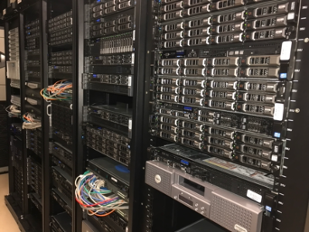

# Biomix Background

Bioinformatics, computational biology, and related fields are increasingly data-intensive, requiring access to advanced computational resources for data analysis and storage.  This section will introduce you to basic concepts in High-performance Computing (HPC) and the CBCB's resources.

## What is HPC?

The purpose of **High-performance Computing (HPC)** is to perform advanced and complex computational tasks. These are tasks that would generally be impossible on a personal computer because of runtime (how long it takes the task to finish) and/or memory requirements.  

HPC is generally performed by either a [supercomputer](https://en.wikipedia.org/wiki/Supercomputer#:~:text=A%20supercomputer%20is%20a%20computer,instructions%20per%20second%20(MIPS)) or a **[computer cluster](https://en.wikipedia.org/wiki/Computer_cluster)**, though clusters have become the much more common infrastructure.  In both cases, HPC is made possible by a combination of systems administration, parallel computing, and job management.  

## What is Biomix?

**[Biomix](https://bioinformatics.udel.edu/core/hpc/)** is one of the University of Delaware's HPC clusters and is used by life science researchers. The computers themselves are hosted by the [Delaware Biotechnology Institute (DBI)](https://www.dbi.udel.edu/) located in the [Ammon Pinizzotto Biopharmaceutical Innovation Center](https://research.udel.edu/initiatives/biopharma/) on UD's STAR Campus.  Biomix is a heterogenous cluster (meaning not all machines are the same) consisting of dozens of machines and containing roughly 4,000 CPU cores in total.  Each machine has 12-48 CPU cores and 128-2048 GB of RAM and some amount of `/scratch` storage (more on this later). 

It can be hard to wrap your mind around what exactly Biomix *is* if you have only ever worked with a PC.  Here is what Biomix looks like in person; a bunch of servers (computers) stacked in rows, in a climate-controlled room to keep them cool and dry:

The machines are networked together to form the cluster and each is referred to as a **node**.  When you initially log in to Biomix, you are connected to the **head node**.  From the head node, you can submit jobs and request resources for computing, which is your way onto the **cluster nodes**.  This is all managed by the job manager/scheduler [Slurm](https://slurm.schedmd.com/overview.html).  We will cover Slurm and the various ways to run jobs on Biomix in a [later lesson](running_jobs_on_biomix.md).  For now, here is a diagram to give you some idea of how Slurm and the nodes work together behind the scenes:

## Who can use Biomix?

Biomix is available to members of the Delaware life sciences community, including those beyond UD.  Some cluster nodes are owned by individual research groups to ensure dedicated storage and analysis resources.  If you are interested in a hardware purchase of your own, we can help you to purchase and maintain your machine.

**Next lesson: [Connecting to Biomix](setup_connect_to_biomix.md)**

