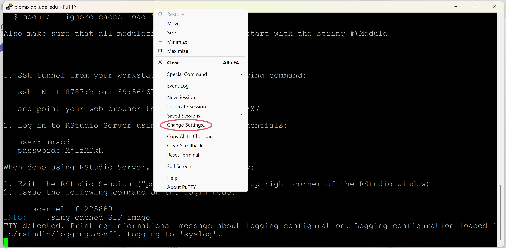
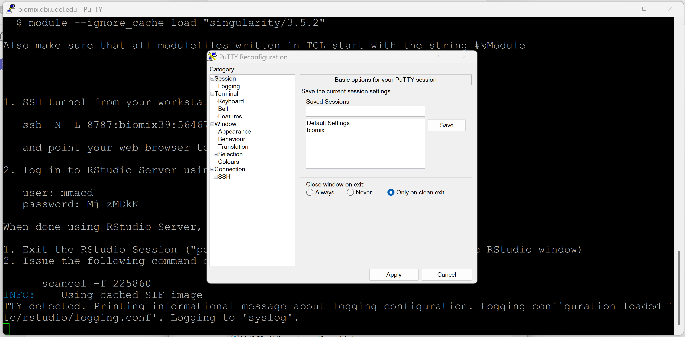
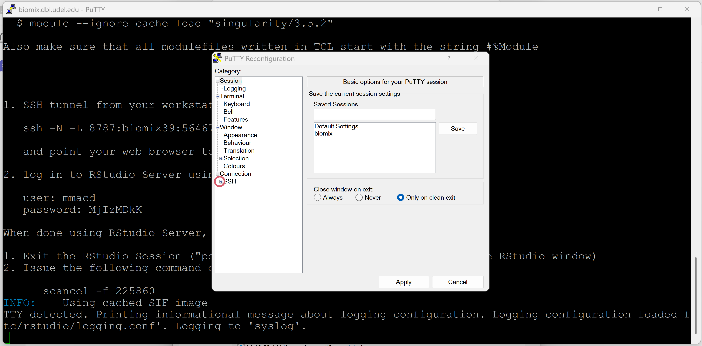
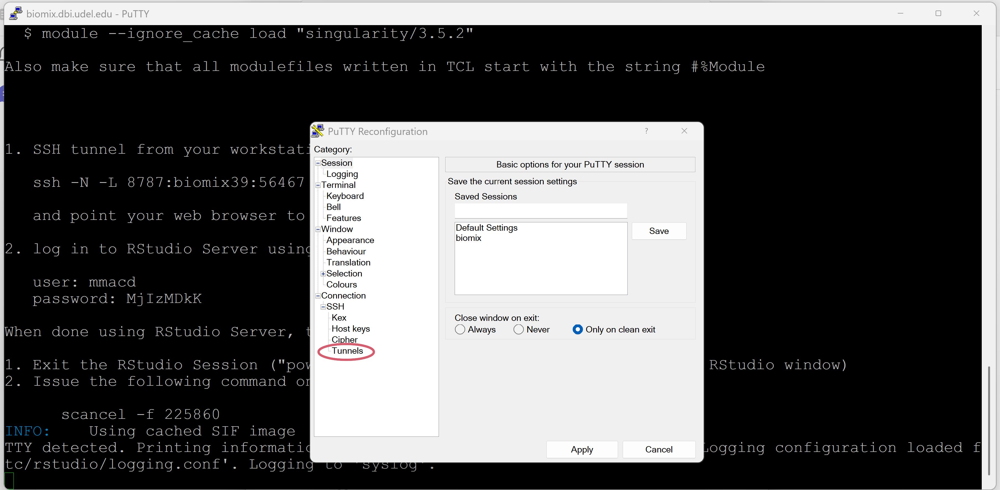
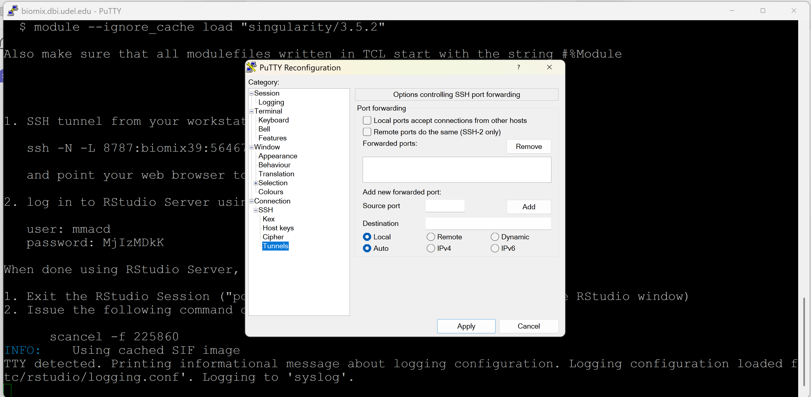
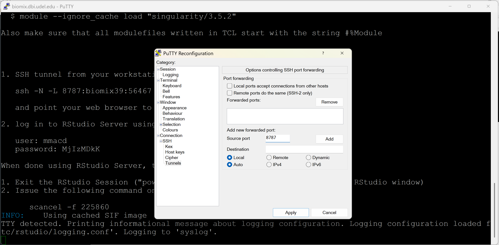
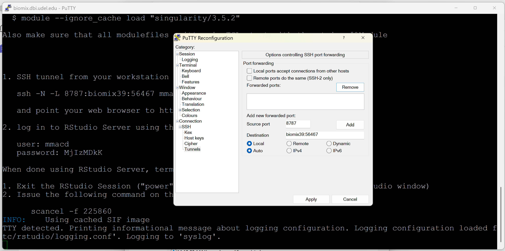
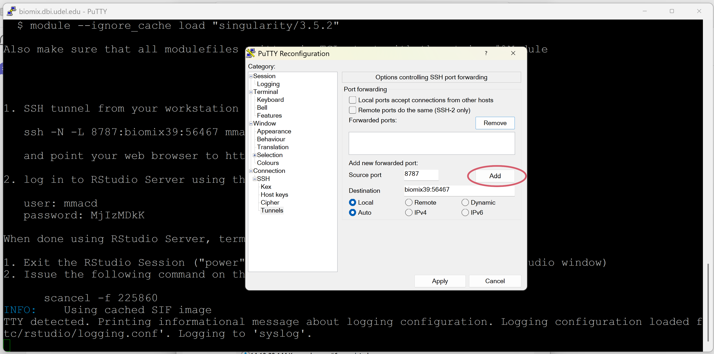
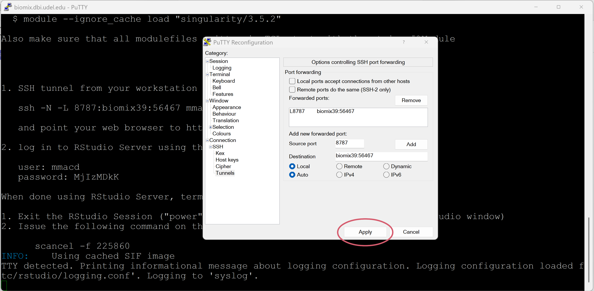
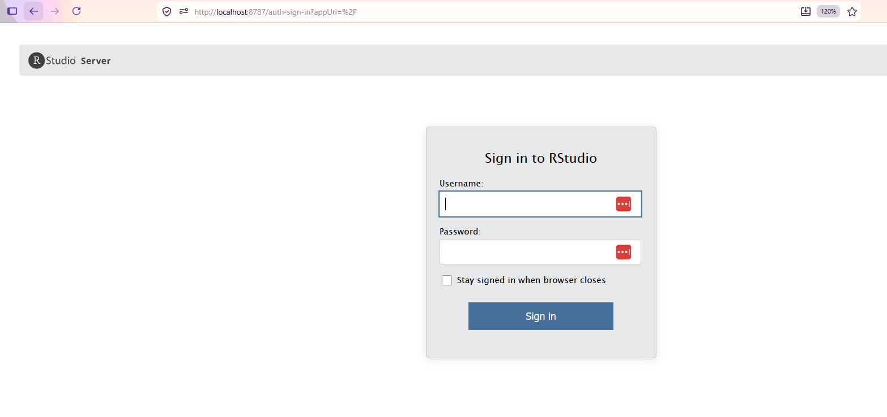

# Rstudio on BIOMIX via a Singularity Container

## Description

Rstudio can be run on the [Biomix HPC cluster](https://bioit.dbi.udel.edu/BIOMIX/BIOMIX-cluster.html) by using a Singularity container that initiates a RStudio server session. This requires runRStudioSingularity.sh, located in `/usr/local/bin`. Submit the SLURM script from the directory you want your singularity/RStudio session to have access to. This is the only directory that you will be able to access to if you run the script as-is (Go to section ['Path Binding'](#path-binding) to see how to add another path/location to your session).

**NOTE: Only run the script as a slurm job (sbatch runRStudioSingularity.sh) as R/RStudio processes can use a lot of memory.**

## Run runRStudioSingularity.sh

Submit the runRStudioSingularity.sh script as a SLURM job from the head node. 

```
sbatch runRStudioSingularity.sh
```

This will submit a job to a BIOMIX computing node. The default number of cores is 8 and the default RAM is 96 Gb. If needed, these can be modified - see ['Requesting More Cores/Memory'](#requesting-more-coresmemory). Next, view the SLURM output file (slurm.NODE.JOBNUMBER.out).

```
cat slurm.NODE.JOBNUMBER.out
```

The instructions will look similar to the following but will have different node and port information: 

```
1. SSH tunnel from your workstation using the following command:

   ssh -N -L 8787:biomix39:56467 mmacd@biomix.dbi.udel.edu

   and point your web browser to http://localhost:8787

2. log in to RStudio Server using the following credentials:

   user: mmacd
   password: MTY1MjUK

When done using RStudio Server, terminate the job by:

1. Exit the RStudio Session ("power" button in the top right corner of the RStudio window)
2. Issue the following command on the login node:

      scancel -f
```

The first step is different depending on how you ssh into BIOMIX. See the appropriate section below.

### Running on Mac/Linux or via WSL (Windows Subsystem for Linux) on Windows

You can run the instructions as-is. Just make sure to run the provided ssh command for step 1 in a new terminal locally (do not ssh into biomix). You will be asked for your BIOMIX password. Enter it and then jump to the instructions in ['Accessing the RStudio Server'](#accessing-the-rstudio-server).

### Running on Windows with PuTTY

After submitting runRStudioSingularity.sh script as a SLURM job and printing the instructions to your screen, you can SSH tunnel by:

1. In the same putty window, right-click on the top bar of the putty screen and then click on 'Change settings...'. This will bring up the PuTTY Reconfiguration window.



2. On the left side of the reconfiguration window, click on the plus symbol by 'SSH' 


3. Click on 'Tunnels'.



4. Add 8787 to 'Source port'


5. Add \${HOSTNAME}:\${PORT} to 'Destination' where HOSTNAME is the BIOMIX node your job was submitted to  (ie. biomix6, biomix20, biomix39 etc.) and where PORT is the number generated by the script. The script will produce a line that looks like: 'ssh -N -L 8787:biomix39:56467 mmacd@LOGIN-HOST' and the number you want to provide will be the '56467'. So for this example, I would add 'biomix39:56467' (job was submitted to node 39) to 'Destination'. 


6. Click on 'Add'


7. Click on 'Apply' near the bottom of the window


## Accessing the RStudio Server

 For both operating systems, the last step is to open up a web browser and point it to 'https://localhost:8787'. If everything is set up correctly, you will see a sign in page for RStudio. Here you will use the username and password generated by script. 



## Reminder

Do not forget to scancel your job when finished. You can only have one tunnel open/rstudio session running at a time. 

## Installing R Packages

There are two options to install packages:

1. Install packages via RStudio (just like you would in a local instance of RStudio) using 'install.packages(package_name)'. These will need to be reinstalled each time you run the instance. However, to get around reinstalling packages each time, you can install the packages once and then save the R environment via 'save.image(file = "my_workspace.RData")'. Then the next time you run R, you can load this environment via 'load("my_workspace.RData")' and all you need is to load the packages with 'library(package_name)'.

2. Modify the dockerfile (or a singularity def file) and add install commands as needed. The instance would then need to be rebuild using 'singularity build' command. However, this requires -fakeroot permissions so is not recommended.


## Advanced Topics

### Requesting More Cores/Memory

If you need more memory and/or more cores for your RStudio session, request more using the sbatch parameters (--cpus-per-task=ncpus and --mem=MB):

```
sbatch --cpus-per-task=12 --mem=128000 runRStudioSingularity.sh 
```

### Changing the Docker image

The [Rocker Project](https://rocker-project.org/) is a good source of dockerfiles and pre-built images for R and RStudio. They have provided pre-built Docker images on Docker Hub that can be directly pulled via the 'singularity exec' command within the script. The Singularity command is smart enough to automatically convert the Docker image into a Singularity instance. 

While the 'singularity exec' command is already in the provided script with 'docker://rocker/rstudio', you may want to use a different container or a specific version of a container. A list of available Docker RStudio images are listed [here](https://rocker-project.org/images/versioned/rstudio.html). You can provide the name of the docker instance as an argument when submitting the script such as:

```
sbatch runRStudioSingularity.sh docker://rocker/tidyverse
```

 If no version of the Docker image is provided, it will pull the most recent version of the RStudio Docker image. You can specify a version for reproducibility/consistency if needed:
 
```
sbatch runRStudioSingularity.sh docker://rocker/rstudio:4.6.1
```
 
 A Singularity image specifically for a single cell RNA-seq analysis with Seurat can be downloaded [here](https://hub.docker.com/r/satijalab/seurat).

### Path Binding

You may want your RStudio to be able to access more locations on BIOMIX that the current working directory (i.e. the directory you ran the script from). To do this, you can 'bind' another path by providing the script '-b/-bind' parameter.

```
sbatch /usr/local/bin/runRStudioSingularity-v2.sh -b /local/path:/home/rstudio/directoryname
``` 

 The bind parameter needs to be in the form of '/local/path:/home/rstudio/directoryname' where 'local/path' is a location you have access to on Biomix and '/home/rstudio/directoryname' is the path within the singularity container ('directoryname' can be whatever you wish). For instance, here I am binding my existing 'inputdir' directory located in my home directory to a directory named 'input_data' in the singularity session. Now, within R, I can access this 'input_data' directory. 
```
sbatch /usr/local/bin/runRStudioSingularity-v2.sh -b /home/mmacd/inputdir:/home/rstudio/input_data
``` 

To avoid confusion, I often use the existing local directory name in the container path:

```
sbatch /usr/local/bin/runRStudioSingularity-v2.sh -b /home/mmacd/inputdir:/home/rstudio/inputdir
```


## Acknowledgment

 These materials contain a modified version of scripts and instructions provided by Alex Lemenze from Rutgers University ([https://github.com/GBIRG/scRNAseq_2022](https://github.com/GBIRG/scRNAseq_2022)). 

