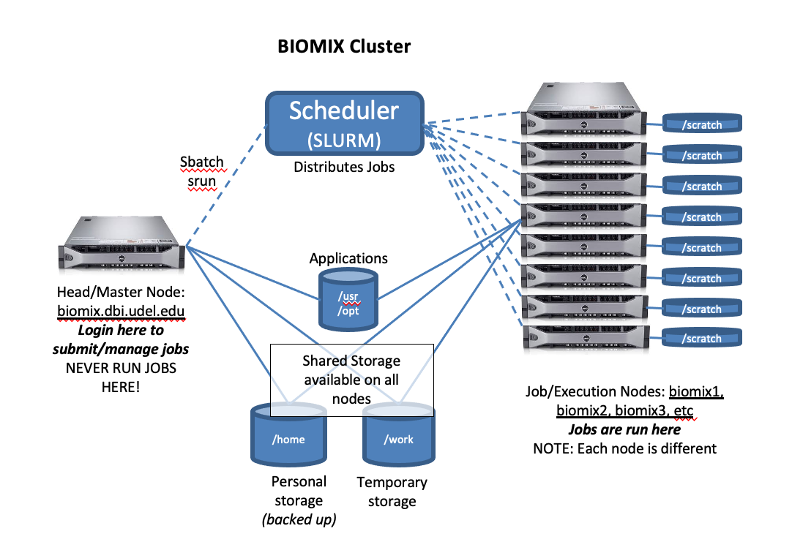

# Interacting with Slurm

*More documentation about [Slurm on Biomix](https://bioit.dbi.udel.edu/BIOMIX/SLURM-intro.html)*.

## What is Slurm?

Recalling the [Biomix Background](intro_to_biomix.md), an HPC cluster is made up of several computers that have been networked together into a single system.  Each computer in a cluster is called a “node.”  When you log onto Biomix, you connect to what’s called the “head node.”  This computer’s job is to intercept incoming traffic and divvy out work to the rest of the nodes.  It does this using Slurm.

[Slurm](https://slurm.schedmd.com/overview.html) is a common cluster management and job scheduling system for Linux clusters, like Biomix. It functions essentially as a traffic director for user computations, ensuring that users aren't competing for the same resource when others are available. 



The head node, where you first land after logging on to Biomix, is not a good place to run jobs.  Running jobs on the head node clogs up the system for everyone, because it uses up computing power that’s supposed to be managing, rather than working.  But, if you are automatically brought to the head node upon logging in, how do you run your job somewhere else?  You guessed it, Slurm!

Note that in this context, jobs are computationally expensive tasks that usually involve running software and generating files.  While there are expensive tasks you can perform that do not involve running software, you can still use "running software" as a good rule of thumb for when to jump off the head node.

## Running jobs using Slurm

There are three ways to run jobs on Biomix:

1. Run a command interactively, straight on the command line.
2. Run a script interactively on the command line.
3. Submit a script to Slurm.

In all cases, you will need to do two things: request the resources (e.g., memory) you think you will need to run your job and the actual command(s) to run the job.  The first two options involve interacting directly with the command line, so you  to request resources up front, and Slurm sends you to a compute node where you can run your command or script.  When using the third option, you submit your request for resources and the job command at the same time in a single script.

**Important note:** To demonstrate job execution in Slurm, we will be using the command line version of the popular software [BLAST](https://blast.ncbi.nlm.nih.gov/Blast.cgi), which performs sequence homology searching.  Because the goal of this tutorial is purely to demonstrate Slurm in action, the different components of the commands will not be explained. To learn more about the BLAST commands themselves, take a look at [this Command Line BLAST tutorial](https://open.oregonstate.education/computationalbiology/chapter/command-line-blast/).  We will, however, cover more about running software on Biomix in general in the next lesson.

To follow along with the hands-on portion of this tutorial, please do the following:

1. Log in to Biomix
2. While in your home directory, run the command `cp -r /work/binf-courses/biomix_tutorial/ .`.  Use `cd biomix_tutorial` to move into the directory you just copied over. 
3. List out the contents of the directory with `ls`. You should see 3 files: `demo-blastp.sh`, `demo-blastp.slurm`, and `demo-query.fasta`.  You will not need to create any of your own files for this tutorial.
4. Now, continue reading through the tutorial and run any commands.  It's important that you stay within the `biomix_tutorial` directory for the commands to work.

### Running commands and scripts interactively

Running commands and scripts interactively is done using the `srun` command.  You should run the command if you plan to follow along.

```{bash}
srun -c 4 --mem=16000 --pty bash
```

The above command requests to be given access to 4 computing cores (`-c`), 16GB of memory (`--mem=1600`), and access to a Bash shell (`--pty bash`).  Note that the shell request always has to come last when using the `srun` command.  The flags shown in the command above will often be the only ones you need.  Another common flag is `--nodelist=biomix#`, which will take you to a specified Biomix node (replace `#` with the node number).  Only do this if you have a good reason to use a specific node.  The other most commonly used flag is `--x11`, which will allow you to launch graphical programs, as discussed [here](graphical_progams_biomix.md).  For other flags, see the [Slurm documentation for srun](https://slurm.schedmd.com/srun.html).

It's very possible that you won't know up front exactly what resources you need.  This often involves some trial and error, especially for memory.  For each job, you will make an educated guess about how much memory you will need, and then add a bit of wiggle room on top of your initial assessment.  You will get better at this estimation over time, especially with repeated use of the same software.  You should refer to software manuals to help you out as you make any estimates.  If the documentation is good, it will have information about runtimes and memory usage.  Don't feel discouraged if you have to re-start jobs a few times; it's all part of the process.  Manuals will also have information about whether software can take advantage of parallelization.  There is more on this below in the section titled "Best practices for requesting CPUs." 

Once you have requested resources, you will be directed to a node that can provide you with those resources.  Once there, you can either run your job interactively, or run a script.  Running something interactively means that you are typing out your full command and executing it on the command line.  For example, see the below command that runs [BLAST](https://blast.ncbi.nlm.nih.gov/Blast.cgi) to perform a sequence homology search.

```{bash}
blastp -query demo-query.fasta -db /dbases/blastDB/v5/nr -out output_interactive_cl.blastp.tsv -evalue 0.01 -max_target_seqs 20 -outfmt 6 -num_threads 4
```

If you are following along, run the above command. It takes ~30 minutes to run, so you may want to cancel it before it finishes.  To do this, press [`control` and `c`](https://en.wikipedia.org/wiki/Control-C) (`^C`) at the same time.  This will cancel the job and return you to the command prompt.

The thing to know about running commands interactively (including when running scripts) is that **you cannot leave entirely interactive commands unattended**.  If your connection to Biomix is severed, either because you logged out or because of internet connection issues, your job will stop running and, usually, there is no chance of recovering any progress made.  For this reason, running jobs interactively this way is risky if the runtime is lengthy.

You can run this same job from within a script rather than directly on the command line.  If you are following along a barebones example script (`demo-blastp.sh`) has been prepared, so there is no need to copy and paste. Running the command `cat demo-blastp.sh` will print the script's contents to your screen, which should match what is shown below.

```{bash}
#!/bin/bash

blastp \
        -query demo-query.fasta \
        -db /dbases/blastDB/v5/nr  \
        -out output_interactive_script.blastp.tsv \
        -evalue 0.01 \
        -max_target_seqs 20 \
        -outfmt 6 \
        -num_threads 4
```

This is the same command as before, but presented on multiple lines for readability.  The backslashes (`\`) are what make this possible by acting as [escape characters](https://tiswww.case.edu/php/chet/bash/bashref.html#Escape-Character).  In general,  the role of an escape character is to change the usual interpretation of something.  In this case, it serves to tell bash that everything from `blastp` to `num_threads 4` is a single command on a single line, even though that's not really the case.  For another example of using `\` to escape a newline, see [this question on StackOverflow](https://superuser.com/questions/508507/linux-bash-script-single-command-but-multiple-lines).

The `#!/bin/bash` line at the top is called the shebang and it tells Slurm to source Bash.  If you're not familiar running bash scripts, please see [this section](https://github.com/aoharrison/Python-Bash-Bootcamp/blob/main/Bash_session_materials/3-Working_with_Scripts.md) of the Bash boot camp.

And here is the command to run the script:

```{bash}
bash blast_script.sh
```

Again, this will take ~30 minutes to run (putting it in script form does nothing to change the resource requirements or runtime), so you may want to cancel it.

In addition to bash, Biomix can run scripts written in any installed programming language.  The most common languages are bash, python, and R.  For python scripts, you would use the shebang `#!/usr/bin/python3` and use `python3 example.py` to run a python script.  For R scripts, you would use the shebang `#!/usr/local/bin/Rscript` and run scripts with `Rscript example.R`.

**To exit an interactive shell, simply run the command `exit`.**  You will be taken back to the head node.

### Submitting a batch job to Slurm

The third option, submitting a batch job (script) directly to Slurm, is most often used for jobs that will take a long time to run.  An interactive job on Biomix will fail if your connection is severed (e.g., if your computer goes to sleep), but a submitted job does not depend on a sustained connection to Biomix and will keep running until it finishes or encounters an error.  To submit a batch job to Slurm, use the `sbatch` command with the following syntax (do not run the line of code directly below, it will not work):

```{bash}
sbatch script.slurm
```

Unlike with `srun`, the commands for `sbatch` actually go inside of the submitted script. Scripts to be submitted to Biomix begin like this:

```{bash}
#!/bin/bash
#SBATCH --job-name=JobName
#SBATCH --cpus-per-task=4
#SBATCH --mem=16000
```

Again, you can see that we start the the bash shebang (`#!/bin/bash`) because the body of the script is still written in Bash, Linux's shell language.  After the shebang are a bunch of lines that start with `#SBATCH`.  Just like the shebang line, they all start with `#` to let Slurm know that they are not part of the script and should not be executed.   Instead, each of these is a different instruction for Slurm itself. They are essentially flags that modify the `sbatch` command.  In fact, you can see that some are equivalent to the ones we used with `srun`.  We used the `--mem` flag to request memory with `srun`.  We actually also used `--CPUs-per-task` earlier as well in its shorter format (`-c`) with `srun`.  The `--job-name`, on the other hand, is new.  This flag, as you might guess, gives the job a name, which will be visible when you submit it.  Make this something informative to remind you of what is running.

Here are some other useful flags that you may want to consider.

* `#SBATCH --time=6-10` allows the user to change the amount of time that a job is allowed to run for without being automatically cancelled.  The default time limit is 2 days.  The example command here allows the job to run for 6 days and 10 hours.
* `#SBATCH --nodelist=biomix5` allows you to run a job on a specific node (in this case, biomix5).
* `#SBATCH --output=<path to file to save STDOUT>` directs standard out (discussed in more detail in the next section) to the specified directory.  By default, standard out is sent to the directory you are in when you submit the job.
* `#SBATCH --error=<path to file to save STDERR>` does the same as above, but for standard error.
* `#SBATCH --mail-user=<email@here>` sends email alerts about your submitted Slurm job.  More on this in the next section.

Here is a version of the script from the previous section that is ready to be submitted to Slurm using `sbatch`.  In the `biomix_tutorial` directory, the Slurm script is named `demo-blastp.slurm` and you can use the `cat` command to print its contents to your screen as well.  Notice that even though the body of the above script is the same as the body of the BLAST script in the previous section and the shebangs are the same, this script ends in `.slurm` rather than `.sh`.  This is to reflect that this script contains those `#SBATCH` commands meant for Slurm.

```{bash}
#!/bin/bash
#SBATCH --job-name=BLASTp
#SBATCH --mem=32000
#SBATCH --cpus-per-task=4


blastp \
	-query demo-query.fasta \
	-db /dbases/blastDB/v5/nr  \
	-out output_batch.blastp.tsv \
	-evalue 0.01 \
	-max_target_seqs 20 \
	-outfmt 6 \
	-num_threads 4
```

To submit the script to Slurm, run the below command:

```{bash}
sbatch demo-blastp.slurm
```

This should result in a small output similar to the following, but with a different job number: `Submitted batch job 228171`.  You will notice that unlike with the interactive job, you are still free to use the terminal as the job is running.  One more quick note on Slurm scripts before we talk about where your jobe "went."

While you can simply add `#SBATCH` commands to a Bash script and submit it to Slurm, the same thing will not work for other languages.  That's because Bash is a shell language; it's meant for working at the command line and is the "default" language for Biomix.  Most of the time, any other langauges you would want to use, like python or R, are scripting languages, which Biomix does not inherently understand.  Because of this, you cannot add `#SBATCH` commands to a non-Bash script and expect it to run. Instead, you will need to include the command for running the non-Bash script inside a Slurm script.  This sounds confusing, but is very simple.  Below is an example of a Slurm script that runs an R script:

```{bash}
#!/bin/bash
#SBATCH --job-name=R-plot
#SBATCH --mem=8000
#SBATCH --cpus-per-task=1

Rscript script.R
```

#### Managing and monitoring jobs submitted to Slurm

Every time you submit a job to Slurm, the first thing you should do is check to see that it is running and did not immediately fail.  The `squeue` command will show you all of the jobs currently running on Biomix.  Look for your username and job name to find yours.  If you do not see your job after a couple of `squeue` attempts, it most likely failed.  **A job submitted to Slurm will run until 1) the job finishes, 2) the program encounters an error and the job fails, 3) the user (or admin) terminates the job, 4) the job exceeds the requested memory resources, or 5) the job exceeds the set time limit.**  

If your job is still running, you will see in the queue that it has an ID number.  Every job submitted to Biomix is given a unique number to identify it.  Note that these numbers are not tied to a specific script; if you run the same script twice, each submission will be given a different number.  You can use this number to monitor only your job with the command `squeue --job #####` (you would replace `#####` with your actual jobid).  If you want to monitor multiple jobs at once, or you don't want to go back and find your jobid, you can ask Slurm to show you any jobs under your username with `squeue -u your_username`.

If you don't want to keep checking the status of your job, you can ask Slurm to email you by adding the following to your script:

```{bash}
#SBATCH --mail-type=END,FAIL
#SBATCH --mail-user=<email@here>
```

The first line will email you when your job ends, either because it has finished or it has failed.  The second line tells Slurm where to send the email.

Whether your job succeeds or fails, **anything that the program you are running writes to standard out (stdout) will appear in a `slurm.out` file** (standard out is covered in the [Bash boot camp](https://github.com/aoharrison/Python-Bash-Bootcamp/tree/main/Bash_session_materials)).  This includes any errors encountered, so you need to check this file if your job fails so you can get information on how to fix it.  This is different from running an interactive job where content for stdout is printed directly to the screen.  These out files take the form of `slurm-#####.out`, where `####` is the ID of a submitted job.  Unless directed to a different location, it will be written to your working directory when you submitted the script.  For help with errors, please see the [troubleshooting guide](troubleshooting_guide.md) and the [FAQs](biomix_faqs.md).

The job ID also comes in handy if you ever need to cancel a job.  For this, just use `scancel #####`.

### Best practices for requesting CPUs

When it comes to requesting CPUs from Slurm, there is a lot of different, but closely related, vocabulary floating around that can confuse users, namely CPUs, cores, and threads.  There is a really good article about the differences [here](https://www.liquidweb.com/blog/difference-cpu-cores-thread/).  If you don't want to read the full article, here is a summary of the most important parts:

A *CPU* (central processing unit) is essentially the brain of a computer.  It may have one or more physical processing units called *cores*.  While CPUs and cores are physical objects (hardware), *threads* are series of digital instructions (software) given to a CPU about how to utilize resources for a program or applciation.  Tis is why, in general, software manuals will refer to "threads", while computers themselves will be concerned with "CPUs" and "cores." 

There are two flags that can be used to request CPUs from Slurm, but you should only use one of them: please use the `-c`/`--CPUs-per-task` flag instead of `--ntasks` to request CPUs/cores.  This is the method we used in the above examples.  Most of the time, their functions are the same, but `--ntasks` can have unpredictable behavior in certain cases.

Also, please keep in mind that **requesting a certain number of CPUs from Slurm doesn't automatically mean that they will be used**.  The number of threads/CPUs also needs to be specified for the software you running (as we did in the BLAST command).  The number requested from Slurm and specified for the software should be the same.  This goes for both interactive and submitted jobs.  

Additionally, all of this will only be possible if software is multithreaded.  [**Multithreading**](https://en.wikipedia.org/wiki/Multithreading_(computer_architecture)) allows for multiple processes to be run at once, speeding up the execution time of a program.  There are a few processes in bioinformatics that have such long runtimes and take up so many computing resources that running them without enabling multiple threads is impractical (e.g., metagenome assembly).  

You will need to check software manuals for instructions on how to use multiple threads, and if that option exists for that software.  For example, here is [BLAST's page about multithreading](https://www.ncbi.nlm.nih.gov/books/NBK571452/).

**Next lesson: [Running software on Biomix](running_software_biomix.md)**
