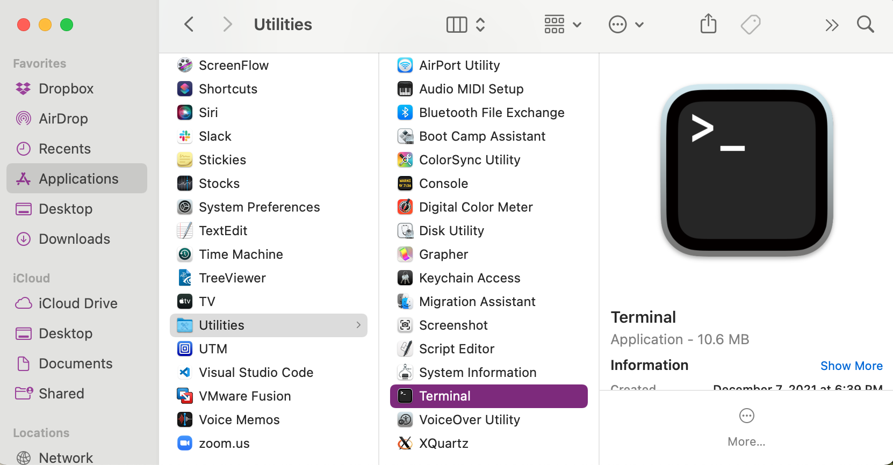
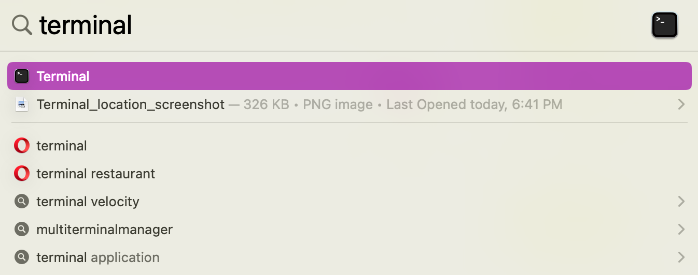
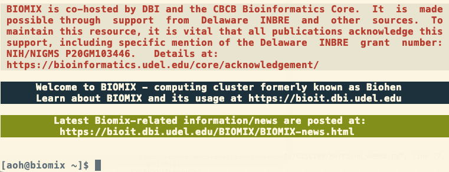
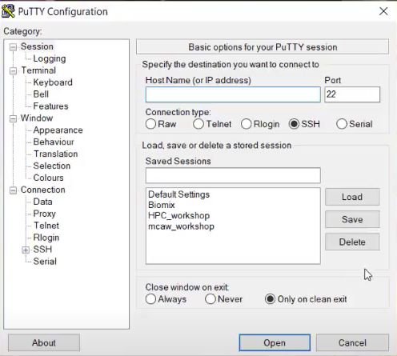

# Connecting to Biomix

In this lesson, you will obtain a Biomix account and log in to Biomix for the first time.  If you did not read the [introductory page](intro_to_biomix.md) on Biomix, now is a good time to do so.

# Setup

*Note: If you are unfamiliar with the [command line](https://www.tenderisthebyte.com/blog/2019/12/15/beginning-bioinformatics-command-line-terminal/), from this point on you may have difficulty completing this tutorial.  A tutorial for using the Bash/the command line is available [here](https://github.com/aoharrison/Python-Bash-Bootcamp/tree/main/Bash_session_materials). Contact Amelia Harrison (aoh@udel.edu) with any questions about these materials*

## Getting an account

Before you can use Biomix, you need an account.  To get an account, please email DBI IT at dbi-it@udel.edu.  Be sure to indicate your role (e.g., faculty, student, etc.) and what institution you are from.  If you are a student researcher, post-doc, or other member of a research lab make sure to include the name and email of your PI.   

Once your account is created, you will receive an email from a DBI IT member with a link.  Whatever text that appears when you click on that link - no matter how odd - is your password.  The link will expire soon (a few days) after it's sent, so be sure to collect your password in a timely manner.  For UD users, your username will be the first part of your email, before the @udel.edu.  For users external to UD, this rule will hold true unless your email username is not in an appropriate format.  In this case, the DBI IT team will choose a username for you.

## Opening a terminal and equipping ssh

You will be interacting with Biomix via a **terminal**, also called a **command line** application, so make sure you can open one.  A terminal allows you to interact with your computer (and remote servers) using text commands, rather than visual interfaces.  Virtually every computer has a terminal, but its location and name will differ based on your operating system.  Also, some operating systems (Windows, generally speaking) come with multiple terminal options, and these may not all be conducive to connecting to Biomix.

Once you have opened your terminal, you will also need to make sure that your computer is properly equipped to connect to Biomix.  Connecting to Biomix requires an **ssh client**, which is a program that allows you to create a secure connection to a remote server. Unfortunately, only some computers come equipped with an ssh client by default.  

Please find your operating system, and in some cases version, below and follow the instructions you find there.

### MacOS

If you are on a Mac, you're in luck!  You already have an ssh client by default and a good terminal, though [iTerm2](https://iterm2.com/) is a popular alternative to the built-in terminal.  You can find your terminal either in `Applications/Utilities`:



Or by using the Spotlight search feature:



Make sure that you can open your terminal, then go ahead to the next section, "Login to Biomix."

### Linux

Linux machines generally come equipped with a terminal.  You should only have to search for "terminal" or "command line" to find it.  Here are some additional resources for the popular distributions [RedHat](https://www.redhat.com/sysadmin/linux-terminal-window) and [Ubuntu](https://itsfoss.com/open-terminal-ubuntu/#:~:text=Method%201%3A%20Launch%20Ubuntu%20terminal%20using%20keyboard%20shortcut&text=Press%20and%20hold%20Ctrl%20first,new%20terminal%20window%20is%20opened) operating systems.

Many Linux distributions come with ssh clients, but not all.  To see if you have one installed, type `ssh` into the terminal and hit enter.  If you have an ssh client, this should prompt a usage message.  If you do not have an ssh client, you should get the error message `command not found` or something similar.  If you get the error, you can install the ssh client OpenSSH by entering this command in the terminal and hitting enter:

```{bash}
sudo apt install openssh-client
``` 

To do this, you will need to be an administrator on the computer and know your password.  You will not be able to see your password as you are typing, but it is being entered.  Once you have done this, test out the `ssh` command again to ensure you don't get the error message.  Then, move on to the next section, "Login to Biomix."

### Windows

Windows users may have multiple options.  Before you jump down to read about them, first check your [Windows version and system type](https://support.microsoft.com/en-us/windows/32-bit-and-64-bit-windows-frequently-asked-questions-c6ca9541-8dce-4d48-0415-94a3faa2e13d) so that you know which options are open to you.  We recommend reading through all of the options before choosing one.

**Option 1:** PuTTY (recommended)

PuTTY is our recommended software for logging on to Biomix.  It's old-school, but easy to use and install, and is the option preferred by some of our own Bioinformatics Core scientists.  You will *need* to use PuTTY if you are running a Windows version earlier than 10.

To use PuTTY, first [download](https://www.chiark.greenend.org.uk/~sgtatham/putty/latest.html) the version that matches your number of bits.  You almost certainly have a 64-bit machince, but you can make sure by [checking your system specs](https://support.microsoft.com/en-us/windows/32-bit-and-64-bit-windows-frequently-asked-questions-c6ca9541-8dce-4d48-0415-94a3faa2e13d).  Then, open the installer file and follow the instructions. We recommend creating a shortcut on your desktop during installation.

**Option 2:** Windows Terminal

If your your machine is on Windows 10 1903 or later, you can use Windows Terminal, which comes equipped with an ssh client.  Visit [this link](https://apps.microsoft.com/store/detail/windows-terminal/9N0DX20HK701?hl=en-us&gl=US) to install Windows Terminal (if you are running Windows 11, your machine may have come pre-equipped with this software by default). Then, visit [this tutorial](https://docs.microsoft.com/en-us/windows/terminal/install) to learn how to setup your terminal.  

The advantage of Windows Terminal is that it requires little setup.  The disadvantage is that Windows Terminal runs a [different shell language](https://www.lifewire.com/list-of-command-prompt-commands-4092302)* than Biomix (which runs Bash), so you will have to learn two shell languages to some extent (though this is less intimidating than it sounds) unless you also install WSL.  If you do install WSL, then Windows Terminal should automatically create a corresponding profile for you, that would use Linux.  See the next section for more information about WSL.  

*There is more information about shells in the optional [Bash boot camp](https://github.com/aoharrison/Python-Bash-Bootcamp/tree/main/Bash_session_materials) in case you are unfamiliar with the concept of shell languages. 

**Option 3:** Windows Subsystem for Linux

This is a good option if you are running Windows 10 version 2004 and higher (Build 19041 and higher) or Windows 11. Windows Subsystem for Linux (WSL) can be installed on your computer by following the instructions [here](https://docs.microsoft.com/en-us/windows/wsl/install).  Note that there is no need to change the default Linux distribution.  Once you have installed WSL, you will need to install the ssh client OpenSSH.  To do so, follow [these instructions](https://docs.microsoft.com/en-us/windows-server/administration/openssh/openssh_install_firstuse?tabs=gui)

The disadvantage of WSL is that it requires more setup than Windows Terminal.  The advantage of WSL is that it provides you with a Linux command line, which is the same type of command line that you will encounter on Biomix.  As mentioned above, WSL can also run in Windows Terminal if both are installed, but there is no need to install Windows Terminal in order to use WSL.

Because WSL runs a Linux command line, be aware that you should use [Linux-style file paths](https://opensource.com/article/19/8/understanding-file-paths-linux) in WSL instead of [Windows-style paths](https://learn.microsoft.com/en-us/dotnet/standard/io/file-path-formats).  WSL will also mimic a Linux file system with your local drives mounted (there is an example in the [WSL FAQs]((https://learn.microsoft.com/en-us/windows/wsl/faq)).

Note: Our users have had trouble in the past launching graphical user interfaces (GUIs) on Biomix when using WSL .  If you will be doing this often, you might want to try PuTTY.

**Option 4: Windows PowerShell**

Finally, you can use Windows PowerShell if you are running at least Windows Server 2019 or Windows 10.  For this option, you will need to install the ssh client OpenSSH by following the instructions in [this guide](https://docs.microsoft.com/en-us/windows-server/administration/openssh/openssh_install_firstuse?tabs=gui).  This is our least recommended option because you still need to install an ssh client and you will need to use a [different shell](https://www.lifewire.com/list-of-command-prompt-commands-4092302) than is used on Biomix.  However, if you are familiar with PowerShell, this would likely be your preferred method.

Once you have installed/confirmed you can open one of the four options above, go ahead to the next section, "Log in to Biomix."

# Logging in to and out of Biomix

If you are using PuTTY, please skip down to the next section, "Logging in with PuTTY."  Otherwise, these instructions should be the same no matter your operating system.

1\. Open up the terminal.  This should be the same one that where you either set up or confirmed the operation of an ssh client.

2\. To log on to Biomix, use the ssh command below with your username in place of `[username]`.  Then hit `enter`.  Note that `biomix.dbi.udel.edu` is the name of the server.

```bash
ssh [username]@biomix.dbi.udel.edu
```

3\. Enter your password when prompted.  Your password will not appear as you type, but it’s there.  You will need to enter your password exactly as it appeared in the link, including capital letters and any special characters.  The backspace key works as well, in case you make a mistake. You can also copy and paste your password in.  Once done, hit `enter`. 

*Note: Entering your password incorrectly multiple times in a row will result in a lock on your account.  The lock will be automatically lifted after a few hours, but you can also contact DBI IT to have it lifted.*

4\. You should now be on Biomix!  A successful login will result in a few messages,
including “Welcome to BIOMIX.”  Here is an example of a successful Biomix login:



5\. To logout of Biomix, type `logout` and hit `enter`.

### Logging in with PuTTY

If you are using PuTTY, please follow these instructions:

1\. Start PuTTY by double-clicking on the icon for the desktop shortcut.  If you did not create a desktop shortcut, you will have to find where you installed PuTTY.  A window like this one should appear:  



2\. In the “Host Name” box, enter `biomix.dbi.udel.edu`. Make sure the port box contains the number `22`.  Hit `open`.  A new window should appear.

3\. Enter your Biomix username.  Hit enter.

4\. A new terminal window will open and prompt you for your password.  Enter your password and hit `enter`.  Note that you will not be able to see your password as you type.  This is normal and you should enter your password as if you could see it.  The backspace key works as well, in case you make a mistake. 

5\. You should now be on Biomix!  A successful login will result in a few messages, including “Welcome to BIOMIX.”  Here is an example of a successful Biomix login: 


6\. To logout of Biomix, type `logout` and hit `enter`.

# Helpful links

Each time you log in to Biomix, there will be a welcome message, information about acknowledgment, and some useful links.  The most important link is [https://bioit.dbi.udel.edu/](https://bioit.dbi.udel.edu/) where you will find documentation about the cluster, including news and a list of pre-installed software.

# Changing your Password

Once you have successfully logged into Biomix, you may want to change your password, though this is not required.  To do this, you will use the password command.  Simply type `passwd` and hit `enter`.  Enter your current password when prompted.  You will then be prompted to enter your new password two times.  After doing so, you will be returned to your normal command prompt and your password will have been changed.


**Next lesson: [Transferring files to and from Biomix](file_transfer_biomix.md)**